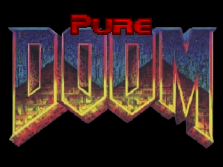

# 본 문서는 PureDOOM의 리드미를 번역한 것입니다.



# Pure DOOM (한국어 번역)

헤더 하나로 끝나는, 의존성 없는 DOOM 소스 포트. 어떤 기기에서도 실행되도록 설계되었습니다.

주로 "전자레인지에서 DOOM을 실행"하고 싶은 분들을 위한 라이브러리입니다.

## 라이선스

파일 맨 아래에 라이선스 정보가 있습니다.

## 주요 특징

- 단일 헤더 파일
- 순수 C, 인클루드 의존성 없음: stdlib, stdio 등 불필요
- 32비트 및 64비트 지원

## 기타 특징

- 마우스 앞뒤 이동 비활성화 메뉴 옵션
- 크로스헤어 옵션
- 항상 달리기 옵션

## TODO

- 커스텀 해상도
- exit 제거 및 종료 시 doom_update가 0 반환하도록 변경. doom_get_exit_code() 추가
- 소켓 및 멀티플레이어 구현

## 있으면 좋을 TODO

- 키 리바인딩
- 잠금 해제된 FPS
- 메뉴에서 마우스 해제 및 클릭에 사용
- 화면 전환 시 메뉴가 멈추는 문제 수정
- fixed_t 대신 float 사용
- 프랑스어 및 독일어 지원
- 풀 컬러 모드 (COLORMAPS 미사용, 24비트 RGB 풀 컬러)

## 사용법

`doom_init()`을 호출한 후, 매 프레임마다(또는 최대한 자주) `doom_update()`를 호출합니다.
이것만으로 DOOM이 실행됩니다(비디오, 입력, 사운드, 음악 없이).

```c
#define DOOM_IMPLEMENTATION 
#include "PureDOOM.h"

int main(int argc, char** argv)
{
    doom_init(argc, argv, 0);
    while (true)
    {
        doom_update();
    }
}
```

## 기능 활성화

대부분의 표준 헤더는 대부분의 플랫폼에서 사용 가능합니다.
아래 전처리기 매크로를 정의하여 기능을 켜고 끌 수 있습니다.

- `DOOM_IMPLEMENT_PRINT` — printf 허용, `<stdio.h>` 필요
- `DOOM_IMPLEMENT_MALLOC` — malloc/free 허용, `<stdlib.h>` 필요
- `DOOM_IMPLEMENT_FILE_IO` — FILE 허용, `<stdio.h>` 필요
- `DOOM_IMPLEMENT_GETTIME` — `<sys/time.h>` 또는 `<winsock.h>` 필요
- `DOOM_IMPLEMENT_EXIT` — exit() 허용, `<stdlib.h>` 필요
- `DOOM_IMPLEMENT_GETENV` — `<stdlib.h>` 필요

전자레인지에 이런 헤더가 없다면, 기본 구현을 직접 오버라이드할 수 있습니다:

```c
void doom_set_print(doom_print_fn print_fn);
void doom_set_malloc(doom_malloc_fn malloc_fn, doom_free_fn free_fn);
void doom_set_file_io(doom_open_fn open_fn,
                      doom_close_fn close_fn,
                      doom_read_fn read_fn,
                      doom_write_fn write_fn,
                      doom_seek_fn seek_fn,
                      doom_tell_fn tell_fn,
                      doom_eof_fn eof_fn);
void doom_set_gettime(doom_gettime_fn gettime_fn);
void doom_set_exit(doom_exit_fn exit_fn);
void doom_set_getenv(doom_getenv_fn getenv_fn);
```

## 비디오

매 프레임마다 `doom_update()` 호출 후, `doom_get_framebuffer`로 화면 픽셀을 가져와 원하는 방식으로 출력할 수 있습니다.

```c
while (true)
{
    doom_update();
    uint8_t* framebuffer = doom_get_framebuffer(4 /* RGBA */);
    // ... 프레임버퍼 출력
}
```

## 입력

기기의 입력 이벤트를 받으면, DOOM 입력 함수 중 하나를 호출합니다:

```c
void doom_key_down(doom_key_t key);
void doom_key_up(doom_key_t key);
void doom_button_down(doom_button_t button);
void doom_button_up(doom_button_t button);
void doom_mouse_move(int delta_x, int delta_y);
```

## 사운드

11025Hz(`DOOM_SAMPLERATE`), 512 샘플, 16비트, 스테레오로 출력하는 사운드 스레드를 만드세요.
사운드 콜백 안에서 `doom_get_sound_buffer`를 호출하여 DOOM의 현재 사운드 출력을 가져옵니다.
사운드 루프가 별도 스레드라면, `doom_update`와 함께 동기화 프리미티브를 반드시 사용하세요.

SDL 오디오 콜백 예시:

```c
void sdl_audio_callback(void* userdata, Uint8* stream, int len)
{
    SDL_LockAudio();
    int16_t* buffer = doom_get_sound_buffer(len);
    SDL_UnlockAudio();

    memcpy(stream, buffer, len);
}
```

다른 비트레이트를 사용할 수도 있지만, DOOM은 항상 11025Hz, 512 샘플, 16비트, 2채널(총 버퍼 2048바이트)로 출력하므로 리샘플링이 필요합니다.

## 음악

140Hz로 실행되는 타이머를 설정하세요. 타이머 콜백 안에서 MIDI 메시지가 있는 동안 DOOM 음악을 틱합니다.

Windows MultiMedia로 MIDI 이벤트를 재생하는 SDL 타이머 예시:

```c
Uint32 tick_music(Uint32 interval, void *param)
{
    uint32_t midi_msg;

    SDL_LockAudio();

    while (midi_msg = doom_tick_midi())
        midiOutShortMsg(midi_out_handle, midi_msg);

    SDL_UnlockAudio();

    return 1000 / DOOM_MIDI_RATE /* 140 */;
}
```

## 기본 설정 변경

DOOM 소스의 기본 입력 설정은 현대적이지 않습니다(방향키로 이동, `,`/`.`로 스트레이프).
`doom_set_default_int`와 `doom_set_default_str`로 변경할 수 있습니다:

```c
// 기본 키 바인딩을 현대적인 방식으로 변경
doom_set_default_int("key_up",          DOOM_KEY_W);
doom_set_default_int("key_down",        DOOM_KEY_S);
doom_set_default_int("key_strafeleft",  DOOM_KEY_A);
doom_set_default_int("key_straferight", DOOM_KEY_D);
doom_set_default_int("key_use",         DOOM_KEY_E);
doom_set_default_int("mouse_move",      0); // 마우스로 앞뒤 이동 비활성화
```

전체 기본값 목록은 `m_misc.cpp`의 defaults를 참고하세요.

## SDL 예제

완전한 SDL 예제는 `src/sdl_example.c` 파일을 참고하세요.

---

> 원문: [PureDOOM/README.md](PureDOOM/README.md)
